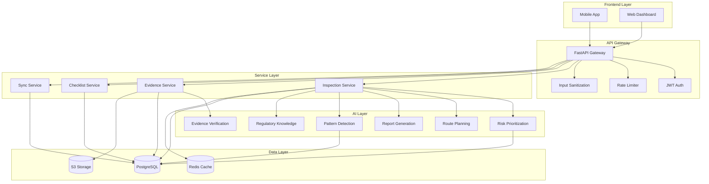

# NIRIKSHA

**Smarter Inspections. Safer Communities. Trusted Decisions.**

## Project Overview

NIRIKSHA is an AI-powered inspection intelligence platform that helps government departments prioritize inspections, verify evidence, and make risk-informed regulatory decisions. Unlike conventional inspection management systems that digitize paperwork, NIRIKSHA introduces an AI decision-support layer that augments inspectors with specialized agents for risk analysis, route optimization, evidence validation, automated reporting, and pattern detection.

**Why it was built:**
- Government departments struggle to identify high-risk establishments with limited inspector capacity
- Existing digital portals store data but lack predictive decision support
- Manual inspection prioritization leads to inefficient resource allocation
- Cross-case intelligence and emerging safety patterns are identified too late

**Problem solved:**
- Transforms inspection data into actionable regulatory intelligence
- Enables risk-based inspection prioritization using historical data and AI
- Reduces administrative burden through automated report generation
- Improves evidence quality through AI-powered verification
- Maintains human oversight with explainable AI recommendations

## Key Features

- **Risk Prioritization Agent** - Identifies establishments requiring urgent inspection using historical violations, complaints, and risk indicators
- **Route Planning Agent** - Optimizes inspector schedules based on location, urgency, travel time, and workload
- **Evidence Verification Agent** - Flags inconsistencies between inspection findings and uploaded images/documents
- **Report Generation Agent** - Drafts inspection reports aligned with department templates automatically
- **Pattern Detection Agent** - Detects recurring violations, geographic clusters, and emerging regulatory risks
- **Regulatory Knowledge Agent** - Retrieves department-specific rules and compliance guidance during inspections
- **Offline-first mobile app** - Supports remote inspections with automatic sync
- **GPS-based check-in/out** - Geofencing and location tracking for accountability
- **Comprehensive audit trails** - State transition history and user action logging
- **Multi-department architecture** - Configurable across food safety, healthcare, fire safety, pollution control, and construction

## System Architecture



**Architecture explanation:** The platform follows a layered architecture with a React-based frontend communicating through a FastAPI gateway. The API layer handles authentication, rate limiting, and input sanitization before routing requests to domain services. Specialized AI agents operate as independent services that can be invoked by domain services for intelligent decision support. Data is stored in PostgreSQL with Redis caching for performance and S3 for file storage.

## AI Agents

- **Risk Prioritization Agent** - Analyzes historical violations, complaints, licensing data, and previous inspection outcomes to recommend high-priority establishments for inspection
- **Route Planning Agent** - Optimizes inspector daily schedules by considering location clusters, urgency levels, travel time, and workload distribution
- **Evidence Verification Agent** - Uses computer vision to validate uploaded photographs against recorded observations, flagging inconsistencies for human review
- **Report Generation Agent** - Automatically drafts structured inspection reports with applicable regulatory provisions and recommendations
- **Pattern Detection Agent** - Identifies recurring violations across jurisdictions, geographic clusters of non-compliance, and emerging regulatory risks
- **Regulatory Knowledge Agent** - Provides instant access to department-specific rules, standards, and compliance guidance during field inspections

## Tech Stack

| Component | Technology |
|-----------|-----------|
| Backend Framework | FastAPI 0.104.1 |
| Database | PostgreSQL 14 |
| ORM | SQLAlchemy 2.0.23 |
| Authentication | JWT (python-jose) |
| Frontend Framework | React 18 with Vite |
| State Management | Zustand |
| Data Fetching | TanStack Query |
| Styling | TailwindCSS |
| UI Components | Radix UI |
| Task Queue | Celery with Redis |
| File Storage | AWS S3 |
| Containerization | Docker & Docker Compose |
| API Documentation | Swagger UI / ReDoc |

## Project Structure

```
niriksha/
├── backend/                          # FastAPI backend
│   ├── api/
│   │   ├── main.py                   # Application entry point
│   │   ├── middleware/               # Auth, rate limiting, sanitization
│   │   ├── routers/                  # API endpoints
│   │   └── schemas/                  # Pydantic validation
│   ├── database/
│   │   ├── models/                   # SQLAlchemy models
│   │   ├── migrations/               # Database migrations
│   │   └── session.py                # Session management
│   ├── repositories/                 # Data access layer
│   ├── services/                     # Business logic
│   │   ├── ai_integration_service.py # AI service integration
│   │   ├── inspection_service.py    # Inspection logic
│   │   ├── evidence_service.py       # Evidence management
│   │   └── checklist_service.py      # Checklist logic
│   ├── tests/                        # Unit & integration tests
│   ├── requirements.txt
│   ├── Dockerfile
│   └── docker-compose.yml
├── frontend/                         # React frontend
│   ├── src/
│   │   ├── components/               # Reusable components
│   │   ├── pages/                    # Page components
│   │   ├── services/                 # API client
│   │   ├── hooks/                    # Custom React hooks
│   │   └── store/                    # State management
│   ├── package.json
│   ├── vite.config.js
│   ├── tailwind.config.js
│   └── Dockerfile
├── inspection-workflow-module/       # Documentation
│   ├── TASK_BREAKDOWN.md
│   ├── BACKEND_ARCHITECTURE.md
│   ├── FRONTEND_ARCHITECTURE.md
│   ├── DATABASE_SCHEMA.md
│   └── TEST_PLAN.md
└── README.md
```

## Workflow

```mermaid
graph LR
    A[Schedule Inspection] --> B[Inspector Check-in]
    B --> C[Conduct Inspection]
    C --> D[Collect Evidence]
    D --> E[Complete Checklist]
    E --> F[AI Evidence Verification]
    F --> G[AI Report Generation]
    G --> H[Inspector Review]
    H --> I[Submit Report]
    I --> J[Supervisor Approval]
    J --> K[AI Pattern Detection]
    K --> L[Risk Prioritization Update]
```



**Flow explanation:** Inspections begin with scheduling based on AI risk prioritization. Inspectors check in at the site using GPS verification, conduct the inspection following standardized checklists, and collect evidence (photos, documents). AI agents verify evidence consistency and draft reports automatically. Inspectors review and submit reports for supervisor approval. After approval, AI pattern detection analyzes data to update risk prioritization for future inspections.

## Installation

### Prerequisites
- Python 3.11+
- Node.js 18+
- PostgreSQL 14+
- Redis
- Docker (optional)

### Backend Setup
```bash
cd backend
python -m venv venv
source venv/bin/activate  # Windows: venv\Scripts\activate
pip install -r requirements.txt
cp .env.example .env
# Configure DATABASE_URL, JWT_SECRET_KEY, ALLOWED_ORIGINS in .env
psql -U user -d niriksha -f database/migrations/001_create_inspection_tables.sql
uvicorn api.main:app --reload
`` API runs on http://localhost:8000

### Frontend Setup
```bash
cd frontend
npm install
cp .env.example .env
# Configure VITE_API_URL in .env
npm run dev
```
Frontend runs on http://localhost:5173

### Docker Setup
```bash
cd backend
docker-compose up --build
```

## Team Responsibilities

| Team Member | Responsibilities |
|-------------|-----------------|
| Pragati | Backend architecture, AI integration, database design, API development |
| Sakshi | Frontend development, UI/UX design, mobile responsiveness, state management |
| Mridu | Testing strategy, quality assurance, documentation, deployment configuration |

## Future Scope

- Multi-department expansion beyond food safety to healthcare, fire safety, pollution control
- Integration with existing government portals (FoSCoS, FoSCoRIS) via APIs
- Advanced computer vision for automated violation detection from images
- Voice-to-text for hands-free note-taking during inspections
- Predictive analytics for forecasting compliance trends
- Mobile app with offline-first capabilities for remote areas

## Screenshots

<!-- 
[Dashboard Screenshot]
[Mobile App Screenshot]
[AI Report Generation Screenshot]
[Risk Prioritization Dashboard Screenshot]
-->

## License

Proprietary - All rights reserved. Government use only.

---

Built for IBM Hackathon 2026 - Government Inspection Intelligence Challenge.

