# Inspection Workflow Module - UX Screen Designs

## Overview
This document describes all 20 screens for the Inspection Workflow & Data Collection Module with detailed specifications and Mermaid wireframes.

---

## Screen 1: Login Screen

**Purpose:** Authenticate inspectors and provide secure access to the system.

**UI Layout:**
- Centered card layout on mobile, split layout on desktop
- Logo at top
- Email/phone input field
- Password input field with toggle visibility
- "Remember me" checkbox
- "Forgot password" link
- Primary login button
- Offline mode indicator

**Components:**
- Logo component (NIRIKSHA branding)
- Input fields with floating labels
- Password strength indicator
- Biometric login button (fingerprint/face ID on supported devices)
- Language selector dropdown

**Buttons:**
- Primary: "Login" (full width)
- Secondary: "Forgot Password" (link)
- Tertiary: "Use Biometric" (icon button)

**Validation:**
- Email/phone format validation
- Password minimum length (8 characters)
- Required field validation
- Account lockout after 5 failed attempts

**User Flow:** Login → Dashboard (or Assignment List if no dashboard)

**Mobile Responsiveness:** Full-screen centered card, touch-friendly inputs (48px min height)

**Error States:**
- Invalid credentials error banner
- Network connectivity error
- Account locked message
- Server unavailable error

**Loading States:**
- Spinner on login button
- Skeleton loader for initial data fetch

**Empty States:** N/A (login screen always has fields)

**Suggested Icons:**
- Lock icon for password field
- Eye icon for password visibility
- Fingerprint icon for biometric login
- Globe icon for language selector

**Suggested Colors:**
- Primary: #2563EB (IBM Blue)
- Background: #F3F4F6
- Card: #FFFFFF
- Error: #DC2626
- Success: #059669

**Mermaid Wireframe:**
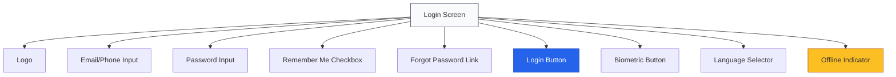

---

## Screen 2: Inspector Dashboard

**Purpose:** Provide inspectors with at-a-glance view of daily assignments, pending tasks, and quick actions.

**UI Layout:**
- Header with user profile and notifications
- Summary cards row (Today's Inspections, Pending Reports, Completed This Week)
- Today's schedule timeline
- Quick actions grid
- Recent activity list

**Components:**
- Summary stat cards with trend indicators
- Timeline component for scheduled inspections
- Quick action buttons with icons
- Notification badge
- Offline sync status indicator
- Date picker

**Buttons:**
- Primary: "Start Next Inspection"
- Secondary: "View All Assignments"
- Tertiary: Quick action icons (New Note, Upload Evidence, Sync Now)

**Validation:** N/A (read-only dashboard)

**User Flow:** Dashboard → Assignment Detail → Inspection Workflow

**Mobile Responsiveness:** Stacked cards on mobile, grid on tablet, dashboard layout on desktop

**Error States:**
- Data fetch error banner
- Sync failure indicator
- Network connectivity warning

**Loading States:**
- Skeleton loaders for stat cards
- Shimmer effect for timeline

**Empty States:**
- "No inspections scheduled today" illustration
- "All caught up!" message when no pending tasks

**Suggested Icons:**
- Calendar icon for schedule
- Checkmark for completed
- Clock for pending
- Sync icon for sync status
- Bell for notifications

**Suggested Colors:**
- Stat cards: #FFFFFF with colored accents
- High priority: #DC2626
- Medium priority: #F59E0B
- Low priority: #10B981
- Sync active: #10B981
- Sync pending: #F59E0B

**Mermaid Wireframe:**
```mermaid
graph TB
    A[Dashboard Header] --> B[Profile Avatar]
    A --> C[Notification Bell]
    A --> D[Sync Status]
    
    E[Summary Cards] --> F[Today's Inspections: 5]
    E --> G[Pending Reports: 2]
    E --> H[Completed This Week: 12]
    
    I[Today's Timeline] --> J[09:00 - Site A]
    I --> K[11:00 - Site B]
    I --> L[14:00 - Site C]
    
    M[Quick Actions] --> N[Start Inspection]
    M --> O[Upload Evidence]
    M --> P[Sync Now]
    M --> Q[View History]
    
    style A fill:#2563eb,color:#ffffff
    style E fill:#ffffff,stroke:#e5e7eb
    style I fill:#ffffff,stroke:#e5e7eb
    style M fill:#ffffff,stroke:#e5e7eb
```

---

## Screen 3: Assignment List Screen

**Purpose:** Display all assigned inspections with filtering, sorting, and search capabilities.

**UI Layout:**
- Search bar at top
- Filter chips (Status, Priority, Date Range, Type)
- Sort dropdown
- List of assignment cards
- Pull-to-refresh indicator
- Infinite scroll loader

**Components:**
- Search input with clear button
- Filter chip group
- Sort dropdown
- Assignment card (site info, priority badge, status, time, location)
- Map preview button
- Swipe actions (accept/decline)

**Buttons:**
- Primary: "Accept" on card
- Secondary: "Decline" on card
- Tertiary: Filter icon, Sort icon, Map view toggle

**Validation:** N/A (list view)

**User Flow:** Assignment List → Assignment Detail → Start Inspection

**Mobile Responsiveness:** Full-width cards on mobile, grid on larger screens

**Error States:**
- No assignments found message
- Filter error banner
- Search API error

**Loading States:**
- Skeleton cards for list
- Spinner for filter application

**Empty States:**
- "No assignments match your filters" illustration
- "No pending assignments" when list is empty

**Suggested Icons:**
- Search icon
- Filter icon
- Sort icon
- Map icon
- Priority flags
- Clock icon
- Location pin

**Suggested Colors:**
- Card background: #FFFFFF
- High priority badge: #FEF2F2 with #DC2626 text
- Medium priority badge: #FFFBEB with #D97706 text
- Low priority badge: #ECFDF5 with #059669 text
- Status badges: #EFF6FF with #2563EB text

**Mermaid Wireframe:**
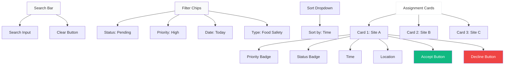

---

## Screen 4: Assignment Detail Screen

**Purpose:** Show comprehensive details about a specific inspection assignment before starting.

**UI Layout:**
- Header with back button and action menu
- Site information card (name, address, contact, license)
- Inspection details (type, priority, scheduled time, estimated duration)
- Previous inspection summary
- Checklist preview
- Map with directions
- Action buttons (Start, Reschedule, Decline)

**Components:**
- Site info card with expandable details
- Inspection metadata grid
- Previous inspection trend indicator
- Mini checklist preview (item count, sections)
- Interactive map component
- Contact quick actions (call, email)
- Document attachments list

**Buttons:**
- Primary: "Start Inspection" (sticky bottom)
- Secondary: "Get Directions"
- Tertiary: "Call Site", "View Documents", "Reschedule"

**Validation:**
- Check if inspection is within allowed time window
- Validate inspector availability
- Check for required pre-inspection documents

**User Flow:** Assignment Detail → Inspection Checklist → Evidence Capture

**Mobile Responsiveness:** Stacked cards, sticky action button at bottom

**Error States:**
- Site not found error
- Map loading error
- Directions API error
- Document fetch error

**Loading States:**
- Skeleton loader for site details
- Map placeholder while loading
- Spinner for directions

**Empty States:**
- "No previous inspections" message
- "No documents attached" message

**Suggested Icons:**
- Back arrow
- Menu dots
- Phone icon
- Email icon
- Map pin
- Clock icon
- Document icon
- Trend icon

**Suggested Colors:**
- Header: #2563EB
- Site card: #FFFFFF
- Action button: #10B981 (green for start)
- Warning: #F59E0B
- Info: #3B82F6

**Mermaid Wireframe:**
```mermaid
graph TB
    A[Header] --> B[Back Button]
    A --> C[Site Name]
    A --> D[Action Menu]
    
    E[Site Info Card] --> F[Business Name]
    E --> G[Address]
    E --> H[Contact Info]
    E --> I[License Number]
    E --> J[Expand Button]
    
    K[Inspection Details] --> L[Type: Food Safety]
    K --> M[Priority: High]
    K --> N[Scheduled: 09:00]
    K --> O[Duration: 2 hrs]
    
    P[Previous Inspection] --> Q[Date: Last Month]
    P --> R[Result: Passed]
    P --> S[Trend: Improving]
    
    T[Checklist Preview] --> U[45 Items]
    T --> V[8 Sections]
    T --> W[View Full]
    
    X[Map] --> Y[Site Location]
    X --> Z[Get Directions]
    
    AA[Sticky Actions] --> AB[Start Inspection]
    AA --> AC[Call Site]
    AA --> AD[Reschedule]
    
    style A fill:#2563eb,color:#ffffff
    style E fill:#ffffff,stroke:#e5e7eb
    style K fill:#ffffff,stroke:#e5e7eb
    style AB fill:#10b981,color:#ffffff
```

---

## Screen 5: Inspection Checklist Screen

**Purpose:** Display and capture checklist responses during inspection with real-time AI assistance.

**UI Layout:**
- Header with progress bar and back button
- Section navigation (horizontal scroll or sidebar)
- Checklist items with response controls
- AI recommendation panel (collapsible)
- Evidence attachment indicator per item
- Sticky bottom action bar (Save, Next Section, Submit)

**Components:**
- Progress bar with percentage
- Section tabs with completion indicators
- Checklist item cards with:
  - Question text
  - Regulatory reference
  - Response options (Yes/No/NA, dropdown, text input)
  - Evidence required badge
  - AI suggestion indicator
  - Notes button
- AI recommendation panel with confidence score
- Offline indicator

**Buttons:**
- Primary: "Next Section" / "Submit Inspection"
- Secondary: "Save Draft", "Add Note", "Attach Evidence"
- Tertiary: Section navigation, AI panel toggle

**Validation:**
- Required field validation
- Evidence attachment validation for critical items
- Response consistency checks
- Section completion validation before submission

**User Flow:** Checklist → Evidence Capture → Report Preview → Submit

**Mobile Responsiveness:** Full-width items, collapsible sections, sticky bottom bar

**Error States:**
- Validation error banner with specific field highlighting
- AI service unavailable warning
- Save failed error
- Network error during sync

**Loading States:**
- Skeleton loader for checklist items
- Spinner for AI recommendations
- Sync indicator

**Empty States:**
- "No items in this section" message
- "AI recommendations unavailable" when offline

**Suggested Icons:**
- Checkmark for completed items
- Warning icon for required evidence
- Lightbulb for AI suggestions
- Camera for evidence
- Note icon for notes
- Chevron for section navigation

**Suggested Colors:**
- Completed item: #ECFDF5
- Incomplete item: #FFFFFF
- Required evidence: #FEF2F2
- AI suggestion: #EFF6FF
- Progress bar: #10B981
- Warning: #F59E0B

**Mermaid Wireframe:**
```mermaid
graph TB
    A[Header] --> B[Back Button]
    A --> C[Progress Bar: 65%]
    A --> D[Save Draft]
    
    E[Section Navigation] --> F[Section 1: General]
    E --> G[Section 2: Hygiene]
    E --> H[Section 3: Storage]
    E --> I[Section 4: Equipment]
    
    J[Checklist Item] --> K[Question Text]
    J --> L[Regulatory Ref]
    J --> M[Response Options]
    J --> N[Evidence Badge]
    J --> O[AI Indicator]
    J --> P[Notes Button]
    
    Q[AI Panel] --> R[Suggestion]
    Q --> S[Confidence: 92%]
    Q --> T[Accept/Dismiss]
    
    U[Sticky Actions] --> V[Next Section]
    U --> W[Submit Inspection]
    
    style A fill:#2563eb,color:#ffffff
    style J fill:#ffffff,stroke:#e5e7eb
    style Q fill:#eff6ff,stroke:#3b82f6
    style V fill:#2563eb,color:#ffffff
    style W fill:#10b981,color:#ffffff
```

---

## Screen 6: Photo Evidence Capture Screen

**Purpose:** Capture, preview, and upload photos as inspection evidence with metadata.

**UI Layout:**
- Full-screen camera view
- Overlay controls (flash, grid, camera switch)
- Capture button with press animation
- Photo preview strip at bottom
- Metadata input form (description, tags)
- AI verification status indicator
- Upload/Retake options

**Components:**
- Camera viewfinder with grid overlay
- Flash toggle button
- Front/back camera switch
- Capture button (large circular)
- Photo thumbnail strip
- Photo preview modal
- Metadata form (description, tags, checklist item reference)
- GPS location indicator
- Timestamp display
- AI verification badge

**Buttons:**
- Primary: "Capture" (large circular button)
- Secondary: "Upload", "Retake", "Add Description"
- Tertiary: Flash, Camera switch, Grid toggle

**Validation:**
- Photo quality check (blur detection)
- GPS location validation
- File size validation
- Required metadata validation

**User Flow:** Camera → Preview → Metadata → Upload → Verification Status

**Mobile Responsiveness:** Full-screen camera, bottom sheet for metadata

**Error States:**
- Camera permission denied
- GPS permission denied
- Storage full error
- Upload failed error
- Network error

**Loading States:**
- Camera initialization spinner
- Upload progress bar
- AI verification spinner

**Empty States:**
- "No photos captured" in thumbnail strip
- "Camera initializing" placeholder

**Suggested Icons:**
- Camera icon
- Flash icon
- Grid icon
- Switch camera icon
- Location pin
- Checkmark for verified
- Warning for issues

**Suggested Colors:**
- Camera overlay: #000000 (semi-transparent)
- Capture button: #FFFFFF with #2563EB ring
- Verified badge: #10B981
- Warning badge: #F59E0B
- Error badge: #DC2626

**Mermaid Wireframe:**
```mermaid
graph TB
    A[Camera Viewfinder] --> B[Grid Overlay]
    A --> C[Flash Toggle]
    A --> D[Camera Switch]
    A --> E[GPS Indicator]
    
    F[Capture Controls] --> G[Large Capture Button]
    F --> H[Thumbnail Strip]
    
    I[Photo Preview] --> J[Image]
    I --> K[Description Input]
    I --> L[Tags Input]
    I --> M[Location Display]
    I --> N[AI Verification Badge]
    
    O[Action Buttons] --> P[Upload]
    O --> Q[Retake]
    O --> R[Cancel]
    
    style A fill:#000000,color:#ffffff
    style G fill:#ffffff,stroke:#2563eb
    style N fill:#10b981,color:#ffffff
    style P fill:#10b981,color:#ffffff
    style Q fill:#6b7280,color:#ffffff
```

---

## Screen 7: Document Upload Screen

**Purpose:** Upload and manage document evidence (PDFs, scanned documents, certificates).

**UI Layout:**
- Header with back button
- Document type selector
- File upload zone (drag & drop)
- Uploaded documents list
- Document preview modal
- Metadata form (document type, description, expiry date)

**Components:**
- Document type dropdown (License, Certificate, Maintenance Record, etc.)
- Upload zone with drag-and-drop support
- File picker button
- Document card with:
  - Document icon
  - Filename
  - File size
  - Upload status
  - Preview button
  - Delete button
- Preview modal with PDF viewer
- Expiry date picker for time-sensitive documents
- Progress bar for upload

**Buttons:**
- Primary: "Upload Document"
- Secondary: "Choose File", "Preview"
- Tertiary: Delete, Cancel

**Validation:**
- File type validation (PDF, JPG, PNG)
- File size validation (max 10MB)
- Required fields validation
- Expiry date validation for certificates

**User Flow:** Document Upload → Preview → Attach to Inspection

**Mobile Responsiveness:** Stacked upload zone, card-based document list

**Error States:**
- Invalid file type error
- File too large error
- Upload failed error
- Preview failed error

**Loading States:**
- Upload progress bar
- Document preview spinner
- File processing indicator

**Empty States:**
- "No documents uploaded" illustration
- "Drag and drop files here" placeholder

**Suggested Icons:**
- Cloud upload icon
- File icon
- PDF icon
- Image icon
- Delete icon
- Preview icon
- Calendar icon for expiry

**Suggested Colors:**
- Upload zone: #F3F4F6 with dashed border
- Upload zone active: #DBEAFE
- Success: #10B981
- Error: #DC2626
- Document card: #FFFFFF

**Mermaid Wireframe:**
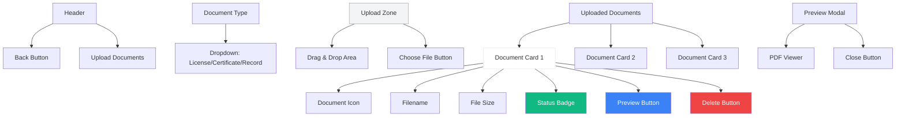

---

## Screen 8: Notes & Observations Editor

**Purpose:** Capture detailed text notes, observations, and contextual information during inspection.

**UI Layout:**
- Header with back button and save indicator
- Note type selector (Observation, Violation, General, Follow-up)
- Rich text editor with formatting toolbar
- Checklist item reference selector
- Voice note recording button
- Saved notes list
- Timestamp display

**Components:**
- Note type chips
- Rich text editor (bold, italic, bullet, numbered list)
- Voice recording button with waveform
- Checklist item autocomplete
- Note cards in list view
- Timestamp and author display
- Edit/Delete actions
- Character count

**Buttons:**
- Primary: "Save Note"
- Secondary: "Record Voice Note", "Attach to Checklist Item"
- Tertiary: Formatting buttons, Delete, Edit

**Validation:**
- Minimum character validation
- Note type required
- Checklist item reference validation for violation notes

**User Flow:** Notes Editor → Save → Attach to Inspection Item

**Mobile Responsiveness:** Full-width editor, bottom sheet for voice recording

**Error States:**
- Save failed error
- Voice recording permission denied
- Network error during sync

**Loading States:**
- Save spinner
- Voice recording indicator
- Sync status

**Empty States:**
- "No notes added yet" message
- "Start typing to add a note" placeholder

**Suggested Icons:**
- Bold, italic, list icons
- Microphone icon
- Link icon
- Checklist icon
- Clock icon
- Edit icon
- Delete icon

**Suggested Colors:**
- Editor: #FFFFFF
- Observation: #EFF6FF
- Violation: #FEF2F2
- General: #F3F4F6
- Follow-up: #FFFBEB
- Recording: #DC2626

**Mermaid Wireframe:**
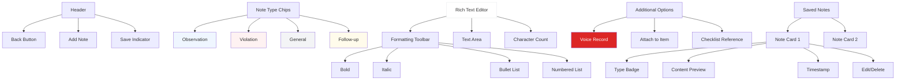

---

## Screen 9: Inspection Status Screen

**Purpose:** Display current inspection status, progress, and state transitions.

**UI Layout:**
- Header with inspection ID
- Status timeline with milestones
- Progress percentage with circular indicator
- Current state details
- Action buttons based on state
- Last sync timestamp
- Offline indicator

**Components:**
- Circular progress indicator
- Timeline component with:
  - Draft
  - In Progress
  - Evidence Collection
  - Review
  - Submitted
  - Under Review
  - Completed
- Current state card with details
- Action button group
- Sync status indicator
- State change history

**Buttons:**
- Primary: State-specific action (Continue, Submit, Resume)
- Secondary: "View Details", "Sync Now"
- Tertiary: "View History", "Download Report"

**Validation:** State transition validation before allowing actions

**User Flow:** Status → Continue Inspection → Submit → Review

**Mobile Responsiveness:** Vertical timeline on mobile, horizontal on desktop

**Error States:**
- State transition error
- Sync failure
- Network error

**Loading States:**
- Status fetch spinner
- State transition spinner

**Empty States:** N/A (status always has current state)

**Suggested Icons:**
- Clock icon for timeline
- Checkmark for completed states
- Spinner for current state
- Sync icon
- Warning icon for issues

**Suggested Colors:**
- Completed: #10B981
- Current: #3B82F6
- Pending: #9CA3AF
- Error: #DC2626
- Warning: #F59E0B

**Mermaid Wireframe:**
```mermaid
graph TB
    A[Header] --> B[Inspection ID]
    A --> C[Status Badge]
    
    D[Progress Circle] --> E[65% Complete]
    
    F[Timeline] --> G[Draft ✓]
    F --> H[In Progress ✓]
    F --> I[Evidence Collection →]
    F --> J[Review ○]
    F --> K[Submitted ○]
    F --> L[Completed ○]
    
    M[Current State Card] --> N[Evidence Collection]
    M --> O[Started: 2 hrs ago]
    M --> P[Items: 30/45]
    M --> Q[Evidence: 12/15]
    
    R[Actions] --> S[Continue]
    R --> T[Sync Now]
    R --> U[View Details]
    
    V[Sync Status] --> W[Last synced: 5 min ago]
    V --> X[Offline: Available]
    
    style G fill:#10b981,color:#ffffff
    style H fill:#10b981,color:#ffffff
    style I fill:#3b82f6,color:#ffffff
    style S fill:#10b981,color:#ffffff
    style M fill:#ffffff,stroke:#e5e7eb
```

---

## Screen 10: Offline Sync Screen

**Purpose:** Manage offline data, sync status, and resolve sync conflicts.

**UI Layout:**
- Header with sync status
- Connection status indicator
- Pending sync items list
- Sync progress bar
- Conflict resolution section
- Manual sync button
- Storage usage indicator

**Components:**
- Connection status card (Online/Offline)
- Sync queue with item details
- Conflict resolution cards with diff view
- Progress bar for sync
- Storage usage bar
- Clear offline data button
- Sync history log

**Buttons:**
- Primary: "Sync Now"
- Secondary: "Resolve Conflicts", "View Sync History"
- Tertiary: "Clear Offline Data", "Cancel Sync"

**Validation:** Conflict resolution validation before sync

**User Flow:** Offline Sync → Resolve Conflicts → Sync Complete

**Mobile Responsiveness:** Card-based list, sticky sync button

**Error States:**
- Sync failed error
- Conflict resolution error
- Storage full error
- Network error

**Loading States:**
- Sync progress bar
- Item sync spinners
- Conflict resolution spinner

**Empty States:**
- "All data synced" message
- "No conflicts to resolve" message
- "No offline data" message

**Suggested Icons:**
- Sync icon (rotating during sync)
- Wifi icon for online
- Wifi-off icon for offline
- Warning icon for conflicts
- Checkmark for synced
- Storage icon

**Suggested Colors:**
- Online: #10B981
- Offline: #F59E0B
- Syncing: #3B82F6
- Conflict: #DC2626
- Synced: #10B981
- Pending: #9CA3AF

**Mermaid Wireframe:**
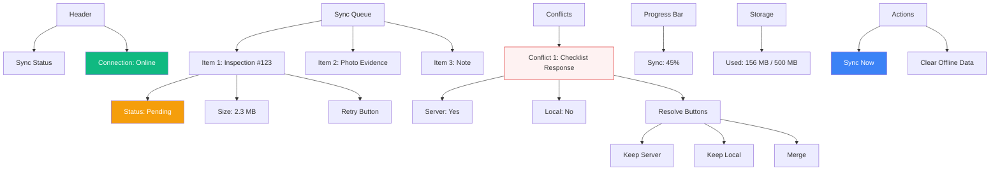

---

## Screen 11: Location Check-in Screen

**Purpose:** Verify inspector location at inspection site with GPS and geofencing.

**UI Layout:**
- Full-screen map view
- Current location marker
- Site location marker
- Distance indicator
- Check-in button (enabled when within geofence)
- GPS accuracy indicator
- Location permission prompt
- Address display

**Components:**
- Interactive map with markers
- Current location pulse animation
- Site location pin
- Distance/ring visualization
- GPS accuracy badge
- Check-in countdown (if outside geofence)
- Address autocomplete
- Manual location override (with approval)

**Buttons:**
- Primary: "Check In" (enabled when within geofence)
- Secondary: "Refresh Location", "Get Directions"
- Tertiary: "Manual Override" (requires justification)

**Validation:**
- GPS accuracy validation (minimum accuracy threshold)
- Geofence validation (must be within allowed radius)
- Location permission validation
- Time window validation

**User Flow:** Location Check-in → Start Inspection

**Mobile Responsiveness:** Full-screen map, bottom sheet for controls

**Error States:**
- GPS permission denied
- Location services disabled
- GPS accuracy too low
- Outside geofence error
- Network error for map tiles

**Loading States:**
- Map loading spinner
- Location acquisition spinner
- Check-in processing spinner

**Empty States:** N/A (map always shows location)

**Suggested Icons:**
- Location pin
- Current location icon
- Checkmark for check-in
- Refresh icon
- Warning icon
- GPS icon

**Suggested Colors:**
- Current location: #3B82F6
- Site location: #10B981
- Geofence: #3B82F6 (semi-transparent)
- Check-in enabled: #10B981
- Check-in disabled: #9CA3AF
- Outside geofence: #DC2626

**Mermaid Wireframe:**
```mermaid
graph TB
    A[Map View] --> B[Current Location Marker]
    A --> C[Site Location Marker]
    A --> D[Geofence Ring]
    A --> E[Distance: 15m]
    
    F[Location Info] --> G[GPS Accuracy: 5m]
    F --> H[Address: 123 Main St]
    F --> I[Within Geofence: Yes]
    
    J[Check-in Status] --> K[Ready to Check In]
    J --> L[Time Window: Valid]
    
    M[Actions] --> N[Check In Button]
    M --> O[Refresh Location]
    M --> P[Get Directions]
    M --> Q[Manual Override]
    
    style B fill:#3b82f6,color:#ffffff
    style C fill:#10b981,color:#ffffff
    style D fill:#3b82f6,stroke:#3b82f6
    style I fill:#10b981,color:#ffffff
    style N fill:#10b981,color:#ffffff
    style Q fill:#6b7280,color:#ffffff
```

---

## Screen 12: AI Verification Status Screen

**Purpose:** Display AI evidence verification results and discrepancy flags.

**UI Layout:**
- Header with verification summary
- Overall verification score
- Discrepancy list with severity
- Evidence preview with AI annotations
- Confidence scores per item
- Resolution actions
- AI reasoning explanation

**Components:**
- Verification score card (0-100)
- Severity badge (Critical, High, Medium, Low)
- Discrepancy cards with:
  - Checklist item
  - Evidence preview
  - AI finding
  - Confidence score
  - Resolution options
- Expandable AI reasoning
- Evidence comparison view
- History of verifications

**Buttons:**
- Primary: "Resolve All", "Accept Findings"
- Secondary: "Dispute", "Request Review"
- Tertiary: "View Evidence", "See Reasoning"

**Validation:** Resolution validation before submission

**User Flow:** Verification Status → Resolve Discrepancies → Submit Inspection

**Mobile Responsiveness:** Card-based discrepancy list, expandable details

**Error States:**
- AI service unavailable
- Verification timeout
- Evidence processing error

**Loading States:**
- Verification progress spinner
- Evidence processing indicator
- AI reasoning loading

**Empty States:**
- "No discrepancies found" success message
- "Verification in progress" message

**Suggested Icons:**
- Shield icon for verification
- Checkmark for verified
- Warning icon for discrepancies
- Eye icon for preview
- Brain icon for AI
- Confidence meter icon

**Suggested Colors:**
- Verified: #10B981
- Critical: #DC2626
- High: #F59E0B
- Medium: #3B82F6
- Low: #6B7280
- AI badge: #8B5CF6

**Mermaid Wireframe:**
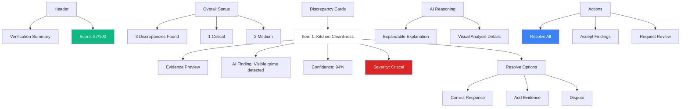

---

## Screen 13: AI Recommendations Screen

**Purpose:** Display real-time AI recommendations and regulatory guidance during inspection.

**UI Layout:**
- Collapsible side panel or bottom sheet
- Recommendation list with categories
- Context-aware suggestions
- Regulatory references
- Accept/Dismiss actions
- Confidence indicators
- Related checklist items

**Components:**
- Recommendation cards with:
  - Suggestion text
  - Category (Safety, Compliance, Efficiency)
  - Confidence score
  - Regulatory citation
  - Related checklist items
  - Accept/Dismiss buttons
- Category filter
- Search recommendations
- History of accepted/dismissed
- Learn more tooltips

**Buttons:**
- Primary: "Accept Recommendation"
- Secondary: "Dismiss", "Learn More"
- Tertiary: "View Related Items", "See Regulation"

**Validation:** None (recommendations are optional)

**User Flow:** AI Recommendations → Accept/Dismiss → Update Checklist

**Mobile Responsiveness:** Bottom sheet on mobile, side panel on desktop

**Error States:**
- AI service unavailable
- Recommendations loading error

**Loading States:**
- Recommendation spinner
- Category loading indicator

**Empty States:**
- "No recommendations at this time" message
- "AI processing" placeholder

**Suggested Icons:**
- Lightbulb icon
- Book icon for regulations
- Checkmark for accept
- X icon for dismiss
- Filter icon
- Search icon

**Suggested Colors:**
- Recommendation card: #EFF6FF
- High confidence: #10B981
- Medium confidence: #F59E0B
- Low confidence: #6B7280
- Accept: #10B981
- Dismiss: #6B7280

**Mermaid Wireframe:**
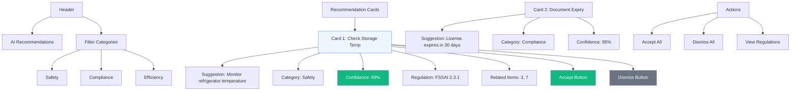

---

## Screen 14: Report Preview Screen

**Purpose:** Preview generated inspection report before submission.

**UI Layout:**
- Header with back button and actions
- Report document viewer
- Table of contents (sidebar on desktop, drawer on mobile)
- Page navigation
- Zoom controls
- Edit sections button
- Submission summary

**Components:**
- PDF/HTML document viewer
- Table of contents navigation
- Page thumbnails
- Zoom in/out
- Section edit buttons
- Summary card (violations, compliance score, recommendations)
- Attachment list
- Signature field (if required)

**Buttons:**
- Primary: "Submit Report"
- Secondary: "Edit Sections", "Download PDF"
- Tertiary: "Add Attachment", "Sign", "Share"

**Validation:**
- Required sections validation
- Signature validation (if required)
- Attachment validation

**User Flow:** Report Preview → Edit (optional) → Submit

**Mobile Responsiveness:** Full document view, drawer for TOC, bottom sheet for actions

**Error States:**
- Report generation error
- PDF rendering error
- Signature capture error

**Loading States:**
- Report generation spinner
- PDF loading indicator
- Section loading spinner

**Empty States:** N/A (report always generated)

**Suggested Icons:**
- Edit icon
- Download icon
- Share icon
- Zoom icons
- Page icon
- Signature icon
- Attachment icon

**Suggested Colors:**
- Header: #2563EB
- Document viewer: #FFFFFF
- Edit button: #3B82F6
- Submit button: #10B981
- Violation: #DC2626
- Compliant: #10B981

**Mermaid Wireframe:**
```mermaid
graph TB
    A[Header] --> B[Back Button]
    A --> C[Report Preview]
    A --> D[Edit]
    A --> E[Download]
    
    F[Document Viewer] --> G[Page 1 of 5]
    F --> H[Report Content]
    
    I[Table of Contents] --> J[1. Executive Summary]
    I --> K[2. Inspection Details]
    I --> L[3. Findings]
    I --> M[4. Violations]
    I --> N[5. Recommendations]
    I --> O[6. Evidence]
    
    P[Summary Card] --> Q[Compliance Score: 85%]
    P --> R[Violations: 3]
    P --> S[Recommendations: 5]
    
    T[Controls] --> U[Zoom In]
    T --> V[Zoom Out]
    T --> W[Page Navigation]
    
    X[Actions] --> Y[Submit Report]
    X --> Z[Add Attachment]
    X --> AA[Sign]
    
    style A fill:#2563eb,color:#ffffff
    style P fill:#ffffff,stroke:#e5e7eb
    style Y fill:#10b981,color:#ffffff
    style Q fill:#10b981,color:#ffffff
    style R fill:#dc2626,color:#ffffff
```

---

## Screen 15: Report Submission Screen

**Purpose:** Submit completed inspection report to Supervisor Dashboard.

**UI Layout:**
- Header with submission status
- Submission summary card
- Report details
- Attachments list
- Inspector comments field
- Recipient selection
- Priority level
- Submit button
- Confirmation modal

**Components:**
- Submission checklist (all required items)
- Report summary with key metrics
- Attachment list with file sizes
- Rich text comments field
- Supervisor/recipient dropdown
- Priority selector (Normal, High, Urgent)
- Terms acknowledgment checkbox
- Confirmation modal with summary

**Buttons:**
- Primary: "Submit Report"
- Secondary: "Save as Draft", "Preview Again"
- Tertiary: "Add Attachment", "Cancel"

**Validation:**
- Required fields validation
- Attachment validation
- Comments validation for violations
- Recipient validation

**User Flow:** Submission → Processing → Confirmation

**Mobile Responsiveness:** Stacked cards, sticky submit button

**Error States:**
- Submission failed error
- Network error
- Attachment upload error
- Validation error banner

**Loading States:**
- Submission progress bar
- Processing spinner
- Attachment upload progress

**Empty States:** N/A (submission always has report)

**Suggested Icons:**
- Send icon
- Attachment icon
- Comment icon
- Priority flags
- Checkmark for submission checklist

**Suggested Colors:**
- Submit button: #10B981
- High priority: #DC2626
- Normal priority: #3B82F6
- Urgent priority: #F59E0B
- Completed checklist: #10B981
- Pending checklist: #9CA3AF

**Mermaid Wireframe:**
```mermaid
graph TB
    A[Header] --> B[Submit Report]
    A --> C[Draft Saved]
    
    D[Submission Checklist] --> E[Report Generated ✓]
    D --> F[Evidence Attached ✓]
    D --> G[Comments Added ○]
    D --> H[Violations Documented ✓]
    
    I[Report Summary] --> J[Site: Restaurant A]
    I --> K[Type: Food Safety]
    I --> L[Date: Today]
    I --> M[Compliance: 85%]
    
    N[Attachments] --> O[Photo Evidence: 12]
    N --> P[Documents: 3]
    N --> Q[Notes: 5]
    
    R[Submission Details] --> S[Recipient: Supervisor]
    R --> T[Priority: High]
    R --> U[Comments Field]
    
    V[Actions] --> W[Submit Report]
    V --> X[Save Draft]
    V --> Y[Preview]
    
    style E fill:#10b981,color:#ffffff
    style G fill:#f59e0b,color:#ffffff
    style W fill:#10b981,color:#ffffff
    style T fill:#dc2626,color:#ffffff
```

---

## Screen 16: Inspection History Screen

**Purpose:** Display inspector's past inspections with search, filter, and detail view.

**UI Layout:**
- Header with search bar
- Filter chips (Status, Date Range, Type, Site)
- Sort dropdown
- Inspection history list
- Summary statistics
- Export button

**Components:**
- Search input with filters
- Filter chip group
- Sort dropdown
- Inspection cards with:
  - Site name
  - Date
  - Status
  - Compliance score
  - Violation count
  - View details button
- Summary stats (total, completed, pending)
- Export options
- Pagination

**Buttons:**
- Primary: "View Details"
- Secondary: "Export", "Filter"
- Tertiary: "Sort", "Search"

**Validation:** N/A (read-only)

**User Flow:** History → Inspection Detail → Report View

**Mobile Responsiveness:** Card-based list, stacked filters

**Error States:**
- Data fetch error
- Export failed error
- Search error

**Loading States:**
- Skeleton cards for list
- Export progress indicator

**Empty States:**
- "No inspection history" illustration
- "No results match your filters" message

**Suggested Icons:**
- Search icon
- Filter icon
- Sort icon
- Export icon
- Calendar icon
- Status icons

**Suggested Colors:**
- Card: #FFFFFF
- Completed: #10B981
- Pending: #F59E0B
- Under Review: #3B82F6
- High compliance: #10B981
- Low compliance: #DC2626

**Mermaid Wireframe:**
```mermaid
graph TB
    A[Header] --> B[Inspection History]
    A --> C[Search Bar]
    A --> D[Export Button]
    
    E[Filter Chips] --> F[Status: All]
    E --> G[Date: This Month]
    E --> H[Type: Food Safety]
    
    I[Sort Dropdown] --> J[Sort by: Date]
    
    K[Summary Stats] --> L[Total: 45]
    K --> M[Completed: 38]
    K --> N[Pending: 5]
    K --> O[Under Review: 2]
    
    P[History Cards] --> Q[Card 1: Restaurant A]
    Q --> R[Date: Jan 15]
    Q --> S[Status: Completed]
    Q --> T[Compliance: 92%]
    Q --> U[Violations: 1]
    Q --> V[View Details]
    
    W[Card 2: Factory B] --> X[Date: Jan 12]
    W --> Y[Status: Under Review]
    W --> Z[Compliance: 78%]
    W --> AA[Violations: 4]
    
    style S fill:#10b981,color:#ffffff
    style Y fill:#3b82f6,color:#ffffff
    style T fill:#10b981,color:#ffffff
    style Z fill:#dc2626,color:#ffffff
    style V fill:#3b82f6,color:#ffffff
```

---

## Screen 17: Route Planning Screen

**Purpose:** Display optimized inspection route with navigation and stop management.

**UI Layout:**
- Full-screen map view
- Route polyline with stops
- Stop list with sequence
- Current location
- Next stop highlight
- ETA display
- Stop details card
- Navigation controls
- Complete stop button

**Components:**
- Interactive map with route
- Numbered stop markers
- Current location pulse
- Route distance/time summary
- Stop cards with:
  - Site name
  - Address
  - Scheduled time
  - ETA
  - Status (Pending, In Progress, Completed)
- Navigation button (opens external maps)
- Complete stop action
- Reorder stops (drag and drop)

**Buttons:**
- Primary: "Navigate to Next Stop", "Complete Stop"
- Secondary: "Optimize Route", "Reorder Stops"
- Tertiary: "View Stop Details", "Skip Stop"

**Validation:** Stop completion validation before marking complete

**User Flow:** Route Planning → Navigate → Complete Stop → Next Stop

**Mobile Responsiveness:** Full-screen map, bottom sheet for stop list

**Error States:**
- Route calculation error
- Maps API error
- GPS error
- Navigation app not found

**Loading States:**
- Route calculation spinner
- Map loading indicator
- ETA calculation

**Empty States:**
- "No stops scheduled" message
- "Route calculation failed" error

**Suggested Icons:**
- Navigation icon
- Map pin icon
- Route icon
- Clock icon
- Checkmark for completed stops
- Car icon for ETA

**Suggested Colors:**
- Route line: #3B82F6
- Completed stop: #10B981
- Current stop: #F59E0B
- Pending stop: #6B7280
- Next stop: #3B82F6

**Mermaid Wireframe:**
```mermaid
graph TB
    A[Map View] --> B[Route Polyline]
    A --> C[Stop Markers]
    A --> D[Current Location]
    
    E[Stop List] --> F[Stop 1: Restaurant A]
    F --> G[Status: Completed ✓]
    F --> H[Time: 09:00 - 10:00]
    
    I[Stop 2: Factory B] --> J[Status: In Progress →]
    I --> K[ETA: 5 min]
    I --> L[Distance: 2.3 km]
    
    M[Stop 3: Hospital C] --> N[Status: Pending]
    M --> O[Scheduled: 14:00]
    
    P[Route Summary] --> Q[Total Distance: 15.2 km]
    P --> R[Total Time: 45 min]
    P --> S[Stops: 3]
    
    T[Actions] --> U[Navigate to Next]
    T --> V[Complete Stop]
    T --> W[Optimize Route]
    
    style G fill:#10b981,color:#ffffff
    style J fill:#f59e0b,color:#ffffff
    style N fill:#6b7280,color:#ffffff
    style U fill:#3b82f6,color:#ffffff
    style V fill:#10b981,color:#ffffff
```

---

## Screen 18: Settings & Language Screen

**Purpose:** Manage inspector preferences, language settings, and app configuration.

**UI Layout:**
- Header with back button
- Settings sections (grouped)
- Language selector
- Theme toggle
- Notification preferences
- Offline settings
- Account settings
- About section

**Components:**
- Section headers with icons
- Language dropdown with flag icons
- Theme toggle (Light/Dark)
- Notification switches
- Offline storage indicator
- Clear cache button
- Account info card
- App version info
- Logout button

**Buttons:**
- Primary: "Save Settings"
- Secondary: "Clear Cache", "Logout"
- Tertiary: Individual setting toggles

**Validation:** Settings validation before save

**User Flow:** Settings → Save → Apply Changes

**Mobile Responsiveness:** Grouped sections, card-based layout

**Error States:**
- Save failed error
- Language download error
- Cache clear error

**Loading States:**
- Save spinner
- Language pack download progress

**Empty States:** N/A (settings always have values)

**Suggested Icons:**
- Language icon
- Theme icon
- Notification icon
- Storage icon
- Account icon
- Logout icon
- Info icon

**Suggested Colors:**
- Section header: #1F2937
- Setting card: #FFFFFF
- Toggle on: #10B981
- Toggle off: #9CA3AF
- Logout: #DC2626

**Mermaid Wireframe:**
```mermaid
graph TB
    A[Header] --> B[Settings]
    A --> C[Back Button]
    
    D[Language Section] --> E[Language Selector]
    E --> F[English]
    E --> G[Hindi]
    E --> H[Tamil]
    
    I[Appearance] --> J[Theme Toggle]
    J --> K[Light/Dark]
    
    L[Notifications] --> M[Push Notifications]
    M --> N[Toggle: On]
    L --> O[Email Alerts]
    O --> P[Toggle: Off]
    
    Q[Offline Settings] --> R[Storage Used: 156 MB]
    Q --> S[Clear Cache Button]
    Q --> T[Auto-sync Toggle]
    
    U[Account] --> V[Profile Card]
    V --> W[Name: Inspector A]
    V --> X[ID: INS-123]
    V --> Y[Edit Profile]
    
    Z[About] --> AA[Version: 1.0.0]
    Z --> AB[Terms of Service]
    Z --> AC[Privacy Policy]
    
    AD[Actions] --> AE[Save Settings]
    AD --> AF[Logout]
    
    style N fill:#10b981,color:#ffffff
    style P fill:#9ca3af,color:#ffffff
    style AE fill:#3b82f6,color:#ffffff
    style AF fill:#dc2626,color:#ffffff
```

---

## Screen 19: Network Error Screen

**Purpose:** Handle network connectivity issues with retry options.

**UI Layout:**
- Centered error illustration
- Error message
- Connection status
- Retry button
- Offline mode option
- Last sync timestamp

**Components:**
- Error illustration/icon
- Error title and description
- Connection status indicator
- Retry button with countdown
- Continue offline button
- Last successful sync time
- Troubleshooting tips

**Buttons:**
- Primary: "Retry Connection"
- Secondary: "Continue Offline"
- Tertiary: "Troubleshoot"

**Validation:** None (error screen)

**User Flow:** Network Error → Retry/Offline → Continue Work

**Mobile Responsiveness:** Centered layout, full-screen on mobile

**Error States:** This IS the error state

**Loading States:**
- Retry spinner
- Connection check spinner

**Empty States:** N/A

**Suggested Icons:**
- Wifi-off icon
- Refresh icon
- Offline icon
- Warning icon

**Suggested Colors:**
- Error icon: #DC2626
- Retry button: #3B82F6
- Offline button: #6B7280
- Background: #F3F4F6

**Mermaid Wireframe:**
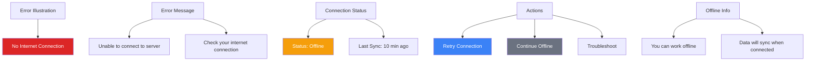

---

## Screen 20: Loading/Spinner Screen

**Purpose:** Display loading state during data fetch, sync, or processing operations.

**UI Layout:**
- Centered spinner animation
- Loading message
- Progress indicator (for long operations)
- Cancel button (for cancellable operations)

**Components:**
- Animated spinner
- Loading text with context
- Progress bar (optional)
- Percentage indicator (optional)
- Cancel button (optional)
- Background overlay

**Buttons:**
- Primary: "Cancel" (if operation is cancellable)

**Validation:** None

**User Flow:** Loading → Complete/Cancel → Next Screen

**Mobile Responsiveness:** Centered overlay, full-screen on mobile

**Error States:** N/A (this is a loading state)

**Loading States:** This IS the loading state

**Empty States:** N/A

**Suggested Icons:**
- Spinner icon (animated)
- Cancel icon

**Suggested Colors:**
- Spinner: #3B82F6
- Background: rgba(0,0,0,0.5) for overlay
- Text: #FFFFFF
- Cancel: #6B7280

**Mermaid Wireframe:**
```mermaid
graph TB
    A[Loading Overlay] --> B[Animated Spinner]
    
    C[Loading Message] --> D[Loading inspection data...]
    C --> E[Please wait]
    
    F[Progress Indicator] --> G[Progress Bar: 65%]
    F --> H[Percentage: 65%]
    
    I[Actions] --> J[Cancel Button]
    
    style B fill:#3b82f6
    style D fill:#ffffff
    style G fill:#3b82f6
    style J fill:#6b7280,color:#ffffff
    style A fill:rgba(0,0,0,0.5)
```

---

## Summary

**Total Screens:** 20

**Screen Categories:**
- Authentication & Onboarding: 1 screen
- Core Workflow: 4 screens
- Evidence Collection: 3 screens
- AI Integration: 2 screens
- Submission & Review: 2 screens
- Supporting Features: 5 screens
- System States: 3 screens

**Design Principles:**
- Mobile-first approach for field inspectors
- Offline-first architecture support
- AI integration points clearly marked
- Enterprise-grade validation and error handling
- Consistent color scheme and iconography
- Touch-friendly controls (48px minimum)
- Clear visual hierarchy and information density
